# Code Quality & Pre-commit Setup

## Overview

This project uses automated code quality tools to ensure consistent formatting and catch issues before they reach the repository.

## Tools

### 🎨 Prettier

- **Purpose**: Code formatting (spacing, line breaks, quotes, etc.)
- **When it runs**: Pre-commit hook + manual
- **Config**: `.prettierrc.json`
- **Ignore**: `.prettierignore`

### 🔍 ESLint

- **Purpose**: Code quality, best practices, bug detection
- **When it runs**: After Prettier in pre-commit hook
- **Config**: `eslint.config.mjs`
- **Ignore**: `.eslintignore`

### 🪝 Husky

- **Purpose**: Git hooks automation
- **Hook**: `.husky/pre-commit` triggers on every commit
- **Setup**: Auto-installed via `npm install`

### 📋 lint-staged

- **Purpose**: Run linters only on staged files (fast!)
- **Config**: `package.json` → `lint-staged` section
- **Flow**: Prettier → ESLint → Auto-stage changes

---

## Pre-commit Hook Flow

```mermaid
graph LR
    A[git commit] --> B[Husky triggers]
    B --> C[lint-staged runs]
    C --> D[Prettier formats]
    D --> E[ESLint fixes]
    E --> F{All checks pass?}
    F -->|Yes| G[Commit succeeds ✅]
    F -->|No| H[Commit blocked ❌]
```



### What Gets Checked?

**On every commit, lint-staged runs:**

1. **For `*.{ts,tsx,js,jsx}` files:**

   ```bash
   prettier --write    # Step 1: Format the code
   eslint --fix        # Step 2: Fix auto-fixable issues
   ```
   
   **Note**: Pre-commit allows warnings (like `console.log`) to pass. Use `npm run lint:strict` to catch all issues before pushing.

2. **For `*.{json,html}` files:**

   ```bash
   prettier --write    # Format only
   ```

3. **For `*.{css,scss}` files:**
   ```bash
   prettier --write    # Format only
   ```

---

## Manual Commands

### Format Code

```bash
# Format all files
npm run format

# Check formatting without changing files
npm run format:check
```

### Lint Code

```bash
# Lint and auto-fix all files (allows warnings)
npm run lint

# Check for issues without fixing (allows warnings)
npm run lint:check

# Strict mode - fail on any warnings (use before push/PR)
npm run lint:strict

# Type checking
npm run type-check
```

---

## Configuration Details

### lint-staged Configuration

Located in `package.json`:

```json
{
  "lint-staged": {
    "*.{ts,tsx,js,jsx}": ["prettier --write", "eslint --fix --max-warnings=0"],
    "*.{json,html}": ["prettier --write"],
    "*.{css,scss}": ["prettier --write"]
  }
}
```

### ESLint Rules Highlights

- ✅ Auto-fixes imports, unused variables, formatting
- ✅ Enforces TypeScript best practices
- ✅ Checks React hooks dependencies
- ✅ Validates accessibility (a11y)
- ✅ Catches common bugs

### Warning Strategy

**Development (Pre-commit)**:
- Warnings are **allowed** (`eslint --fix` without `--max-warnings`)
- Speeds up development workflow
- Common warnings: `console.log`, unused variables in work-in-progress code

**Production (CI/CD)**:
- Use `npm run lint:strict` (with `--max-warnings=0`)
- Blocks deployment if any warnings exist
- Enforces clean production code

**Example workflow**:
```bash
# During development - commit with warnings
git commit -m "WIP: feature"  # ✅ Passes with console.log

# Before pushing/PR - ensure clean code
npm run lint:strict           # ❌ Fails on console.log
# Remove console.log statements
npm run lint:strict           # ✅ Passes
git push
```

### Prettier Configuration

Key settings in `.prettierrc.json`:

```json
{
  "printWidth": 140,
  "tabWidth": 2,
  "useTabs": false,
  "semi": true,
  "singleQuote": false,
  "trailingComma": "es5",
  "arrowParens": "always"
}
```

---

## Best Practices

### ✅ DO

- **Commit frequently** - The hook runs fast on small changesets
- **Stage files incrementally** - Only staged files are checked
- **Fix issues immediately** - Don't accumulate warnings
- **Use manual commands** - Run `npm run lint` before committing large changes

### ❌ DON'T

- **Don't bypass hooks** - Using `--no-verify` defeats the purpose
- **Don't commit broken code** - Fix issues, don't ignore them
- **Don't disable rules** - Unless absolutely necessary
- **Don't stage everything blindly** - Review what you're committing

---

## Troubleshooting

### Hook doesn't run?

```bash
# Reinstall Husky
npx husky install

# Make hook executable
chmod +x .husky/pre-commit
```

### ESLint fails with errors?

```bash
# Run lint manually to see all issues
npm run lint:check

# Auto-fix what's possible
npm run lint
```

### Prettier and ESLint conflict?

The configuration uses `eslint-config-prettier` which disables ESLint formatting rules that conflict with Prettier. ESLint only handles code quality, not formatting.

### Too slow?

lint-staged only runs on staged files. If you have many large files:

```bash
# Commit smaller chunks
git add specific-file.ts
git commit -m "message"
```

---

## Updating Tools

To update the tooling:

```bash
npm update husky lint-staged prettier eslint
```

After updates, test the setup:

```bash
# Test lint-staged manually
npx lint-staged

# Test with an actual commit
git commit --allow-empty -m "test: verify hooks"
```
